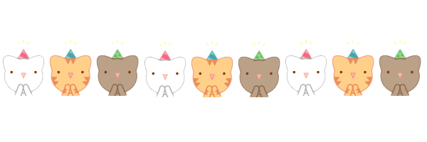

# Bienvenido a mi GITHUB

**¡Hi! I'm Pamela Contreras, but you can call me Pam. I am a Statistician, Data Scientist in process, Front-End developer apprentice 
with some Natural language processing knowledge, I love art, poetry, warm conversations accompanied by coffee and swimming. 
WELCOME TO MY GITHUB  🙌 👯**

    

  

<section>
    <embed src="img/music.mp3" autostart= "True" loop="False" width="650" height="400">
</section>
  
  
* 🧠 I am currently studying at Laboratoria, at the Front End bootcamp 🤩. I do projects in `HTML`,` CSS`, `Javascript` 
and I learn about agile culture.
  
* 👩‍💻 I learn from Machine learning, NLP, web development, to be a good Front End developer apprentice.
  
* 🌱I am very interested in participating in projects that involve my skills and reinforce them.
  
* 📚 You can ask me about Statistics and mathematics, I am open to support.
  
* 🎨 If you want to talk about poetry, do research, or anything related to collage, painting, and books, I am open to long conversations.
  
* ☎ How to reach me: contrerasbardalesp@gmail.com, or you can visit my [Linkedin](https://www.linkedin.com/in/pamela-paola-contreras-bardales/)
  

    

